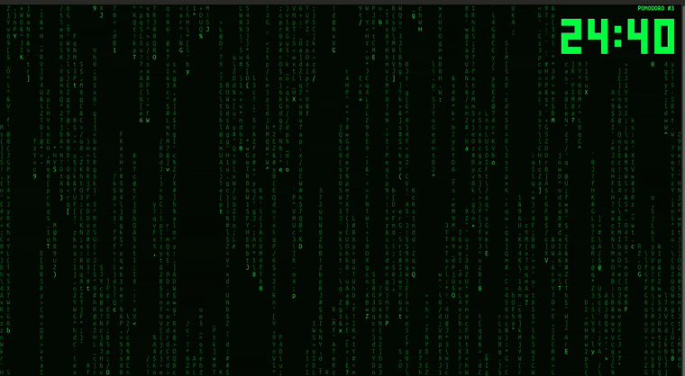
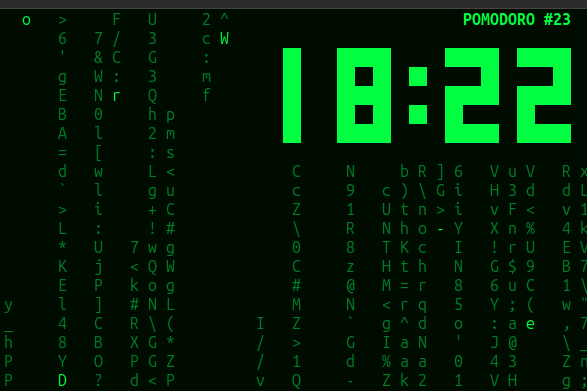

# PMatrix

Matrix rain + a Pomodoro timer in your terminal. The green rain falls while you
work; when the pomodoro ends it freezes and a big break countdown takes over the
screen, then the rain resumes for the next one.





## Usage

```sh
pmatrix              # 25 min work / 5 min break (defaults)
pmatrix -W 50 -R 10  # 50 min work / 10 min break
pmatrix -W 0         # disable the timer (plain rain)
```

| Key | Work | Break |
|---|---|---|
| `space` / `p` | pause rain + clock | pause the countdown |
| `s` | skip to break | end break, next pomodoro |
| `q` | quit | quit |

Run `pmatrix -h` or `man pmatrix` for the full set of options (colors, bold,
async scroll, rainbow/lambda modes, …) inherited from CMatrix.

## Build & install

```sh
./configure && make && sudo make install   # autotools
# or:  mkdir build && cd build && cmake .. && make && sudo make install
```

Needs a wide-character ncurses library (`sudo apt install libncurses-dev` on
Debian/Ubuntu).

## Credits & license

A fork of [CMatrix](https://github.com/abishekvashok/cmatrix) by Chris Allegretta
and Abishek V Ashok — the pomodoro layer is a thin addition on top. GPL-3.0, same
as upstream. [View license](./COPYING)
